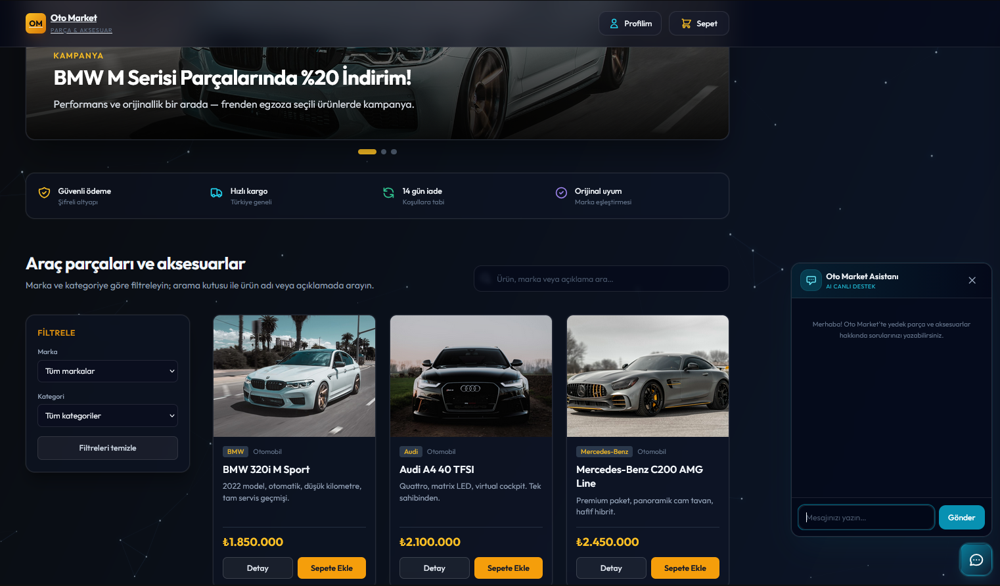

# Oto Market — Yerel çalıştırma

Bu proje **Flask** (site + profil) ve isteğe bağlı **Node** (AI canlı destek) kullanır. Sayfa ve giriş için **`app.py`** şart; sohbet için **`server.js`** ayrı çalışır.

**Arayüz:** ürün arama, yükleme iskeleti, sepete eklendi bildirimi, ürün detay modali, güven şeridi, müşteri yorumları (örnek), footer (iletişim / yasal / sosyal).

## Gereksinimler

| | |
|---|---|
| **Python** | 3.10+ — `py` veya `python` |
| **Node.js** | LTS (AI sohbet için) — [nodejs.org](https://nodejs.org/) |
| **npm** | Node ile gelir |

**Python paketleri:** `py -m pip install -r requirements.txt` (Flask vb.)

**Node paketleri:** `npm install` (Express, OpenAI, dotenv, cors — `package.json`)

## Ana site + profil (Flask)

```bash
py -m pip install -r requirements.txt
py app.py
```

Tarayıcı: **http://127.0.0.1:5000** — `index.html`’i `file://` ile açmayın.

## AI canlı destek (Node, `server.js`)

1. **`.env`** oluşturun: `.env.example` dosyasını kopyalayıp `.env` yapın; içine `OPENAI_API_KEY=...` yazın. **`.env` GitHub’a gitmez** (`.gitignore`).

2. Ayrı bir terminalde:

```bash
npm install
npm run chat
```

Varsayılan adres: **http://127.0.0.1:5001** — arayüz Flask’tan (`5000`) bu API’ye bağlanır.

3. Siteyi **5000** portundan açın; sağ alttaki sohbet ikonunu kullanın.

Durdurma: ilgili terminalde **Ctrl+C**.

## Notlar

- `users.db` Flask ile oluşur; repoya eklenmemesi hedeflenir.
- API anahtarını **koda yazmayın**; yalnızca `.env` kullanın.

- 
